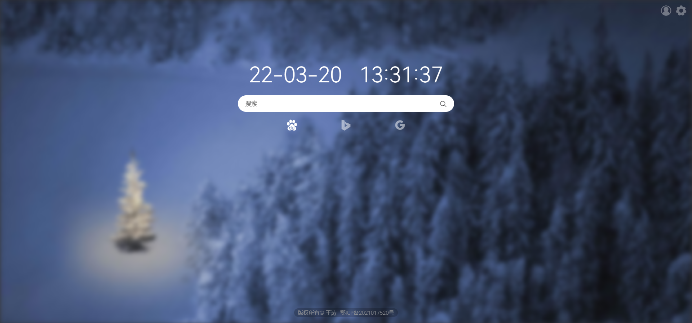

## 简洁的浏览器起始页

### 项目预览



### 项目安装

###### 前端

前端使用vue-cli构建，目前包含起始页主页、登录注册页、个人空间页、云笔记页。目前只有起始页主页完成度较高。

```shell
npm install
```
```shell
npm run serve
```
```shell
npm run build
```

###### 后端

后端使用Django+uWSGI+Nginx服务，将前端打包文件放到`/start_page/frontend/dist`目录下即可，数据库使用MySQL，可在`/start_page/start_page/settings.py`中自行配置。

```shell
uwsgi --ini uwsgi.ini
```

在Nginx中，将所有静态资源（favicon.ico、css、js、fonts、img）请求直接定位到`/start_page/frontend/dist`下，动态请求转发给uWSGI。

### 本项目仅供学习使用，如需上传至服务器使用，请修改声明、域名与备案信息

